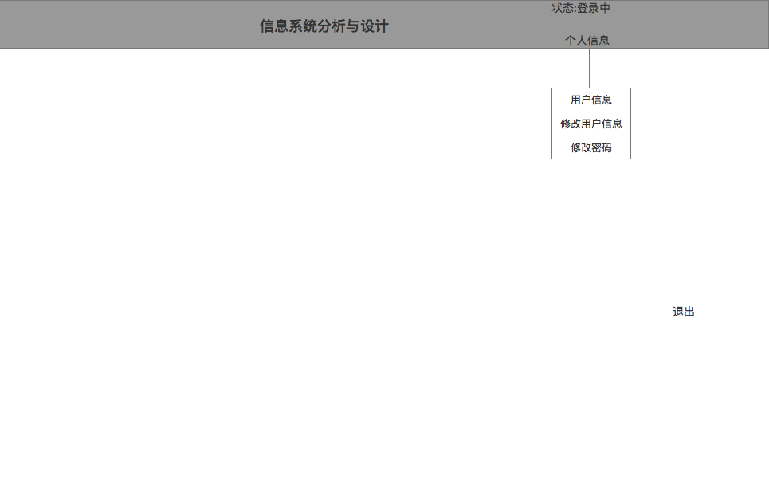

<!-- markdownlint-disable MD033-->
<!-- 禁止MD033类型的警告 https://www.npmjs.com/package/markdownlint -->

# “查看用户信息”用例 [返回](../README.md)
## 1. 用例规约

|用例名称|查看用户信息|
|-------|:-------------|
|功能|查看用户的所有信息|
|参与者|学生，老师|
|前置条件|必须先登录|
|后置条件| |
|主事件流| |
|备选事件流| |

## 2. 业务流程
无

## 3. 界面设计
 
 注(修改用户信息与查看用户信息在同一个界面显示)
 详情代码参见https://github.com/GuoYaoWen123/is_analysis/blob/master/test6/修改用户信息.html
- API接口调用
    - 接口1：[getUserInfo](../接口/getUserInfo.md)

## 4. 算法描述
无
    
## 5. 参照表
- [STUDENTS](../数据库设计.md#STUDENTS)
- [TEACHERS](../数据库设计.md#TEACHERS)
- [USERS](../数据库设计.md#USERS)
